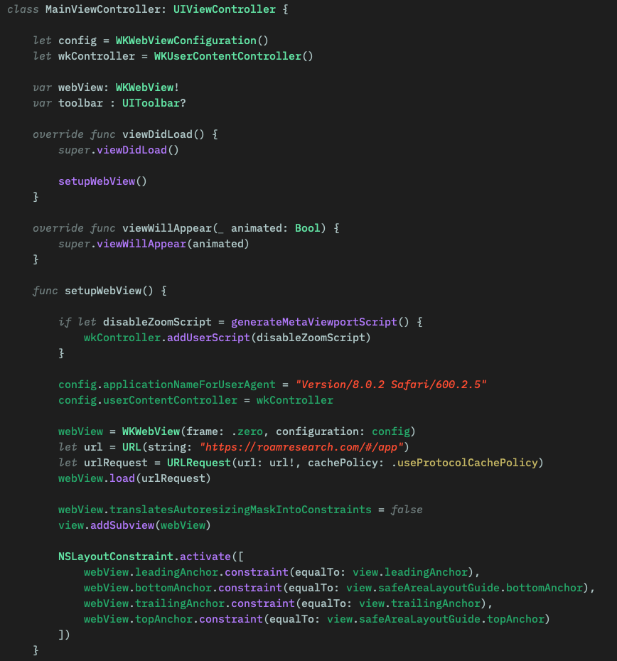

# 🌈 My Xcode theme 🎨
This repository contains Xcode theme that I use.

This theme is heavily inspired by [Point-Free’s Xcode theme](https://github.com/pointfreeco/pointfreeco) and [John Sundells’](https://github.com/JohnSundell/XcodeTheme). Feel free to use it!

## Spectrum Preview

## How to install
1. Download or clone this repo
2. Move `Spectrum.xccolortheme` or `XSpectrum.xccolortheme` to `~/Library/Developer/Xcode/UserData/FontAndColorThemes`
3. Apply Spectrum theme from Xcode Preferences > Fonts & Colors (You might need to restart Xcode first)

There's other variant called XSpectrum where I use muted color for keyword. This is heavily inspired by [Tokyo](https://github.com/cseanc/Tokyo) Xcode color scheme by Sean Choo.

## XSpectrum Preview

PS: I use Consolas font for Spectrum preview and IBM Plex Mono which is my daily driver font in XSpectrum. If you looking for nice font with ligature support, my recommendation is [Hasklig](https://github.com/i-tu/Hasklig) or [Fira Code](https://github.com/tonsky/FiraCode)

